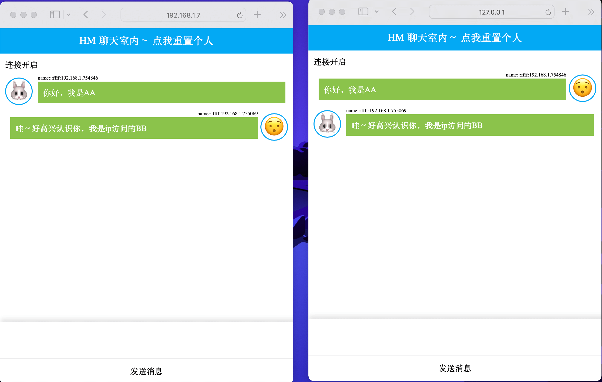

# 本地运行
```
第一步安装依赖
yarn
第二步开启WebSocket
node index.js 

客户端运行
文件layout/index.html
建议采用
http://localhost/layout/index.html
和
http://[你的本地ip]/layout/index.html
开启对话聊天可以看到效果

```

# 服务器部署
node index.js 开启后端
文件layout 前端运行文件

# 效果图
 